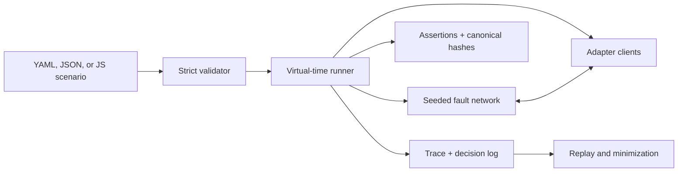

# SyncLab

> Deterministically break sync before your users do.

[](https://github.com/sahilhirani/synclab/actions/workflows/ci.yml)
[](LICENSE)
[](package.json)
[](SECURITY.md)

SyncLab is a deterministic chaos-testing toolkit for local-first, offline-first, CRDT, and replicated applications. It runs multiple clients against a virtual network, injects partitions, delay, loss, duplication, reordering, restarts, storage resets, and clock skew, then proves whether the replicas converge and your application invariants still hold.

It ships with real [Yjs](https://github.com/yjs/yjs) and [Automerge](https://github.com/automerge/automerge) adapters, a dependency-free reference model, a TypeScript API, and a CLI that produces replayable failure artifacts.

## Try it in 30 seconds

SyncLab is ready to run from this repository:

```bash
git clone https://github.com/sahilhirani/synclab.git
cd synclab
npm ci
npm run build
node dist/cli.js run examples/partitioned-notes.yml
```

The example creates three Yjs clients, isolates all of them, performs concurrent edits, reconnects them over a duplicated and reordered link, and checks both convergence and application-level expectations:

```text
PASS  partitioned notes converge
seed: notes-demo-42
adapter: yjs@13.6.31
virtual time: 49ms | events: 6 | queued: 0
  ✓ SYNC002: 3 clients converged
  ✓ SYNC009: No messages or adapter work are pending
  ✓ BODY_A: alice contains the expected value
  ✓ BODY_B: alice contains the expected value
  ✓ BODY_C: alice contains the expected value
```

Create a scenario of your own:

```bash
node dist/cli.js init my-sync-test.yml --adapter automerge
node dist/cli.js run my-sync-test.yml --seed pr-482
```

The npm package name `synclab` is reserved in the project metadata but has not been published yet. Until the first registry release, use the source workflow above or a GitHub release tarball.

## A complete scenario

```yaml
version: 1
name: offline edits converge
adapter: yjs
seed: checkout-42
clients: [alice, bob, carol]
initial:
  body: ""
  edits: {}
network:
  latencyMs: { min: 5, max: 40 }
  duplicateRate: 0.25
  reorderRate: 0.5
  reorderWindowMs: 30
steps:
  - partition:
      groups: [[alice], [bob], [carol]]
  - parallel:
      - client: alice
        operation: { type: set, path: [edits, alice], value: drafted }
      - client: bob
        operation: { type: set, path: [edits, bob], value: reviewed }
      - client: carol
        operation: { type: text-insert, path: [body], index: 0, text: "C" }
  - heal: true
  - settle: true
  - assert: { id: SYNC002, type: converged }
  - assert: { id: SYNC009, type: no-pending }
```

There are no sleeps or real sockets. `settle` drains a deterministic event queue, and the same scenario, seed, SyncLab version, adapter version, and runtime compatibility tuple produce the same decisions and trace fingerprint.

## What it catches

- Replicas that silently diverge after reconnecting.
- Updates lost across offline periods, restart, or storage reconstruction.
- Duplicate application when a message is replayed.
- Causal bugs exposed by out-of-order dependent messages.
- Sync loops or work that never reaches quiescence.
- Application invariants broken by concurrent edits.
- Nondeterministic failures that cannot be reproduced from their seed.

SyncLab fails closed when it exhausts a configured event, queue, payload, or virtual-time budget. A budget exhaustion is `inconclusive`, never a pass.

## Fault and lifecycle model

| Step | Behavior |
|---|---|
| `partition` | Blocks traffic between declared client groups while preserving intra-group traffic. |
| `heal` | Restores links and triggers pairwise anti-entropy synchronization. |
| `network` | Changes global or directed-link latency, drop, duplicate, and reorder settings. |
| `tick` | Advances virtual time by an exact amount. |
| `settle` | Delivers queued work until quiescent or the event budget is reached. |
| `sync` | Explicitly exchanges complete adapter state with peers. |
| `restart` | Restarts a client while preserving its durable replica state. |
| `reset` | Clears a client's state, rotates its replica identity, and optionally reconstructs it from peers. |
| `clock` | Applies wall-clock skew to one client without changing simulator time. |

Every probabilistic decision is drawn from a named, versioned PRNG stream and recorded. Network traffic records hashes and sizes by default, so diagnosis does not depend on dumping raw protocol bytes.

## Operations and assertions

Built-in adapters share a portable operation set:

- `set`, `delete`, `merge`, and `increment`
- `list-insert` and `list-delete`
- `text-insert` and `text-delete`
- `custom` for adapters that define application-specific operations

The v1 scenario schema includes these assertions:

| Assertion | Checks |
|---|---|
| `converged` | Canonical state hashes and adapter convergence metadata match. |
| `equals` / `not-equals` | One client has the expected value at a path. |
| `all-equal` | Every selected client has the expected value at a path. |
| `contains` | A string, list, or object contains the expected value. |
| `length` | A string, list, or object has the expected size. |
| `no-pending` | The network queue and adapter pending-work counts are zero. |

Unknown keys, unknown clients, malformed paths, incomplete partitions, incompatible schema versions, and invalid probability ranges are rejected before execution.

## Replay and minimize failures

When a run fails, SyncLab writes a self-contained `.synclab.json` artifact containing the normalized scenario, exact seed, environment and adapter versions, decision log, event trace, final states, assertion details, and failure signature.

```bash
node dist/cli.js run examples/intentional-failure.yml
# artifact: .synclab/intentional-invariant-failure-failure-demo.synclab.json

node dist/cli.js replay .synclab/intentional-invariant-failure-failure-demo.synclab.json
node dist/cli.js minimize .synclab/intentional-invariant-failure-failure-demo.synclab.json
```

`replay` stops with `TRACE_DIVERGENCE` when the new fingerprint differs. `minimize` uses deterministic delta debugging to remove top-level steps while preserving the original invariant ID and failure signature.

Replay is strict about the SyncLab version by default. `--allow-version-drift` is available for investigation, but a cross-version match is not guaranteed.

## CLI

```text
synclab init [file] [--adapter reference|yjs|automerge]
synclab validate <scenario>
synclab run <scenario> [--seed value] [--format pretty|json|junit]
synclab replay <artifact> [--allow-version-drift]
synclab minimize <artifact> [--output file]
synclab doctor [--json]
synclab adapter test <reference|yjs|automerge|module>
synclab adapters
```

`run` supports human-readable, stable JSON, and JUnit XML output. Machine-readable output stays on stdout; artifact notices and diagnostics go to stderr.

| Exit | Meaning |
|---:|---|
| `0` | All assertions passed. |
| `1` | An invariant or state assertion failed. |
| `2` | The scenario or command input is invalid. |
| `3` | An adapter, harness, or replay error occurred. |
| `4` | The run was inconclusive because a resource limit was reached. |

Run `synclab doctor` to execute the public lifecycle, duplication, partition, and reconstruction conformance suite against every built-in adapter.

## TypeScript API

```ts
import { defineScenario, runScenario } from "synclab";

const scenario = defineScenario({
  version: 1,
  name: "two replicas converge",
  adapter: "automerge",
  seed: 42,
  clients: ["left", "right"],
  initial: { status: "draft" },
  steps: [
    {
      action: {
        client: "left",
        operation: { type: "set", path: ["status"], value: "published" },
      },
    },
    { settle: true },
    { assert: { type: "converged" } },
  ],
});

const artifact = await runScenario(scenario);
if (artifact.report.status !== "pass") {
  console.error(artifact.report.failureSignature);
}
```

The package exports strict scenario, adapter, report, trace, operation, and assertion types, plus canonicalization, artifact, reporter, replay, minimization, and adapter-conformance utilities.

## Adapters

| Adapter | Status | Tested surface |
|---|---|---|
| `reference` | Stable | Deterministic operation-log CRDT; executable transport specification. |
| `yjs` | Stable for v1 operations | Y.Map, Y.Array, Y.Text, state-vector metadata, restart/reset, full-state anti-entropy. |
| `automerge` | Stable for v1 operations | Maps, lists, collaborative text, heads metadata, dependency buffering, restart/reset. |
| Custom module | Supported | Any trusted ESM module implementing `AdapterFactory`; validate it with `synclab adapter test`. |
| Electric, Dexie, PowerSync | Planned | Community adapters can use the public SDK contract. |

See [adapter authoring](docs/adapter-authoring.md) and the [custom adapter example](examples/custom-adapter/adapter.mjs).

## How it works



The simulator is a cooperative, single-threaded discrete-event kernel. Adapters receive injected virtual time and deterministic randomness. Local updates are broadcast as binary payloads through the fault network; `heal`, `sync`, restart, and reset use complete state exchange for anti-entropy.

Read the [architecture](docs/architecture.md), [scenario reference](docs/scenario-reference.md), and [determinism contract](docs/determinism.md) for the exact semantics.

## Security and privacy

SyncLab has no telemetry and does not open network connections. Scenario JavaScript files and custom adapters execute as trusted code in the current Node process—they are not sandboxed.

Trace events redact operation values by default, but an artifact still contains the scenario and final client states. Treat artifacts as application data, sanitize them before sharing, and never place production secrets in a scenario. `--trace-values` deliberately records more state for local debugging.

Report vulnerabilities through GitHub Private Vulnerability Reporting as described in [SECURITY.md](SECURITY.md).

## Scope and limitations

The current release is an in-process protocol and state-model harness. It does not launch browsers, exercise real IndexedDB eviction, proxy production WebSockets, inspect encrypted payloads, validate authorization isolation, or emulate every vendor's server. Yjs Awareness/presence and provider-specific transports are out of scope for the built-in Yjs adapter.

Those boundaries are deliberate: the deterministic kernel and adapter contract stay small enough to audit. Browser drivers, database-backed adapters, schema-version matrices, authorization hooks, and bounded workload generation are tracked in the [roadmap](ROADMAP.md).

## Development

Requires Node 22.14 or newer and npm 11.

```bash
npm ci
npm run check
npm run test:coverage
npm run pack:check
```

`npm run check` type-checks the strict TypeScript project, runs unit/integration/CLI/replay tests, builds declarations and source maps, and executes every passing example. The suite includes 100 consecutive replay checks, 300 bounded generated chaos scenarios, and a public conformance suite for all three built-in adapters.

Contributions are welcome. Start with [CONTRIBUTING.md](CONTRIBUTING.md), use [Discussions](https://github.com/sahilhirani/synclab/discussions) for design questions, and file reproducible bugs with the exact seed and a sanitized artifact.

## License

Apache License 2.0. See [LICENSE](LICENSE).
